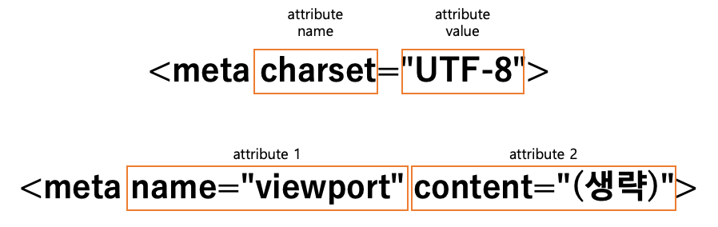

# HTML

HTML은 HyperText Markup Language의 약자이다.
Markdown과 마찬가지로 구조를 표현하기 위한 언어이다.

HyperText는 흔히 웹사이트에서 보는 다른 페이지로 가기 위한 링크를 의미한다.
우리는 링크를 통해서 복잡한 주소 대신에 원하는 페이지를 쉽게 찾을 수 있다.
즉 HTML은 HyperText를 포함한 문서를 구조화하기 위한 Markup Language이다.

## Elements

```html
<!DOCTYPE html>
<html lang="en">
  <head>
    <meta charset="UTF-8">
    <meta name="viewport" content="width=device-width, initial-scale=1.0">
    <title>Title Element</title>
  </head>
  <body>
    Hello World!
  </body>
</html>
```

HTML은 요소로 이루어져 있다.
기본적으로 요소는 여는 태그, 닫는 태그로 구분되며, 그 사이에 표현하는 데이터가 내용으로 들어간다.


또한 HTML 자체에 대한 정보를 작성하기 위해 속성을 부여할 수 있다.



### `<head>`, `<body>`

HTML 문서는 크게 `<head>`와 `<body>`로 나눌 수 있다.

- `head` - HTML 문서의 인코딩, 스타일 등, 문서 자체를 설명하는 메타데이터(metadata)를 담는 요소
- `body` -  실제 사용자에게 보이고 싶은 정보가 담기는 요소

## HTML Body

Body에는 웹페이지에 보여주고 싶은 내용을 다 작성하게 된다. 이는 Markdown과 유사.

### 제목, Heading

```html
<h1>Heading 1</h1>
<h2>Heading 2</h2>
<h3>Heading 3</h3>
<h4>Heading 4</h4>
<h5>Heading 5</h5>
<h6>Heading 6</h6>
```

### 문단, Paragraph

```html
<h1>Heading 1</h1>
<p>Paragraph for heading 1</p>
<h2>Heading 2</h2>
<p>Paragraph for heading 2</p>
```

HTML 내부에선 반복되는 띄어쓰기나 줄바꿈을 한번으로 간주한다. 줄을 바꾸고 싶다면 `<br>`, 공백을 만들고 싶다면 `&nbsp;`을 사용한다. 단, 시각적 효과를 위해서 사용하는 것은 지양하도록 한다.

```html
<p>Lorem ipsum dolor sit amet,&nbsp;&nbsp;&nbsp; consectetur adipiscing elit.<br>
Mauris non consectetur ligula.<br>
Ut sed cursus nisl.<br>
Aenean egestas velit vel ipsum suscipit feugiat.<br>
Nullam malesuada elit eget nunc rhoncus viverra.<br>
Aenean auctor scelerisque consectetur.<br>
Aliquam tempor tempus felis ac tristique.<br>
Nullam nisl elit, volutpat sed malesuada in, pulvinar in eros.</p>
```

### 목록, List

순서가 있는 목록과 순서가 없는 목록으로 구분한다.


```html
<h3>오늘 할 일</h3>
<ul>
  <li>OOP 공부</li>
  <li>1일 1문제</li>
  <li>HTML 연습</li>
</ul>
<h3>아침 만들기</h3>
<ol>
  <li>식빵 굽고</li>
  <li>치즈 올리고</li>
  <li>계란 후라이 해서 덮기</li>
</ol>
```

### 이미지, Image

`` 태그는 내용은 없고, 대신 두개의 속성을 사용한다.
- `src` - 이미지가 어디있는지 (파일 또는 인터넷 링크)
- `alt` - 이미지 대체 텍스트, 이미지를 찾을 수 없는 상황에서 보여주는 문구, 또는 스크린 리더를 위한 텍스트

```html


```


### 링크, Anchor

`href` 속성으로 어디로 가는 링크인지를, `target` 속성으로 어떤 탭에서 열건지를 정할 수 있다.

```html
<a href="[https://www.google.com](https://www.google.com/)">Google</a>
<a href="[https://www.naver.com](https://www.naver.com/)" target="_blank">NAVER</a>
```

### `<div>`, `<span>`

여러 요소를 묶어서 관리하여, `id`와 `class` 속성을 주어 CSS를 적용하기 위해 많이 사용한다.

```html
<div>
  <h2>Sample heading</h2>
  <p>
    <span>Lorem ipsum</span> dolor sit amet consectetur adipisicing elit. Voluptates aut aliquam, natus tempora nihil explicabo sunt corrupti nisi architecto repellat aspernatur earum incidunt? Optio nulla officia obcaecati perspiciatis illum error.
  </p>
</div>
```

### `<form>`, `<input>`, `<label>`

- `<form>` - 사용자가 데이터를 입력할 수 있는 양식
- `<input>` - 사용자의 항목별 데이터를 입력하는 칸
- `<label>` - `<input>`을 설명하고, 사용하는 편의를 제공하기 위한 요소

```html
<form>
  <label>이름: <input type="text"></label><br><br>
  <label>나이: <input type="text"></label><br><br>
  <label>전공: <input type="text"></label><br><br>
  성별
  <label for="male">남: </label>
  <input type="radio" name="gender" value="M" id="male">
  <label for="female">여: </label>
  <input type="radio" name="gender" value="F" id="female">
  <br>
</form>
```

그 외 수많은 요소, 속성이 있다. 이는 CSS도 마찬가지. 따라서 [MDN](https://developer.mozilla.org/en-US/) 등의 문서를 잘 활용하는 습관을 기르는게 좋다.

