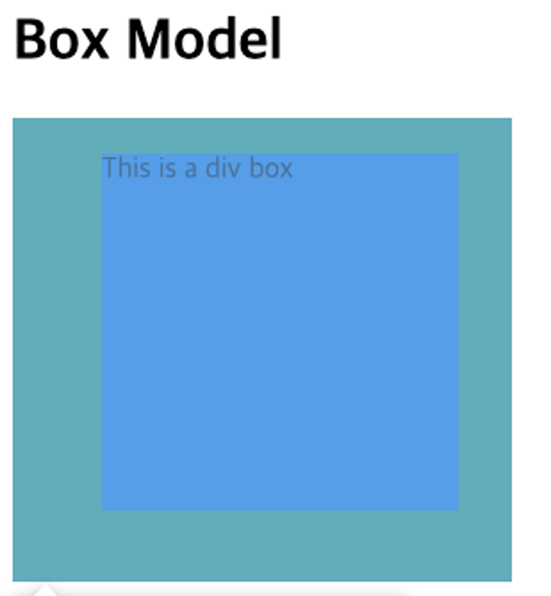

# CSS Box Model

요소는 크게 정의될때 다음줄로 내려가는 Block 요소와 다음줄로 내려가지 않고 내용 안에서 만들어지는 Inline 요소로 나눌 수 있다.

```html
<!-- block  -->
<h1>제목 요소는 Block 요소</h1>
<p>본문 요소도 Block 요소</p>
<p>본문 안에 <h2>제목을</h2> 
중간에 끊기고 아래로 내려갑니다.</p>

<!-- inline -->
<p>앵커 요소는 인라인 입니다. 본문 안에 
<a href="https://example.com" target="_blank">링크</a>
를 만들어도, 아래로 내려가지 않습니다.</p>
```

기본적으로 Block 요소는 브라우저에 네모 형태의 공간을 차지하며, 어느정도의 공간을 차지할지를 CSS를 이용해 정할 수 있다. 그리고 이렇게 네모를 조절하며 요소들이 어떻게 상호작용하며 배치될지에 대한 원리가 CSS Box Model이다.


- Content - HTML 요소의 글이나 이미지 등의 실제 내용이 존재하는 공간
- Border - HTML 요소의 테두리 영역
- Padding - HTML 요소의 border 부터 content 까지의 여백 공간
- Margin - HTML 요소 바깥의 요소와의 공간

### `width` & `height`

요소의 높이와 너비를 조절하는 속성.

```css
#box-model {
  background-color: dodgerblue;
  width: 200px;
  height: 200px;
}
```

### `margin` & `padding`

요소와 요소의 간격, 또는 요소와 내용의 간격을 조절하는 속성.

- `margin-*`, `padding-*`과 방향 (`top`, `right`, `bottom`, `left`)를 통해 조절.

```css
#box-model {
  background-color: dodgerblue;
  width: 200px;
  height: 200px;
  margin-top: 50px;
  margin-right: 100px;
  margin-bottom: 150px;
  margin-left: 200px;
}
```


```css
#box-model {
  background-color: dodgerblue;
  width: 200px;
  height: 200px;
  padding-top: 20px;
  padding-right: 30px;
  padding-bottom: 40px;
  padding-left: 50px;
}
```



만약 네 방향의 공백이 동일하다면, `margin`, `padding` 속성을 사용 가능.

```css
#box-model {
  background-color: dodgerblue;
  width: 200px;
  height: 200px;
  margin: 30px;
  padding: 30px;
}
```

또는 상하좌우의 여백을 한번에 정의할수도 있다.

```css
.shorthand-1 {
  /* 상하 좌우 */
  margin: 10px 20px;
  padding: 10px 20px;
}

.shorthand-2 {
  /* 상 좌우 하 */
  margin: 10px 20px 30px;
  padding: 10px 20px 30px;
}

.shorthand-3 {
  /* 상 우 하 좌 */
  margin: 10px 20px 30px 40px;
  padding: 10px 20px 30px 40px;
}
```

### border

`border-*` 속성을 이용해 테두리를 적용할 수 있다.

- `border-width`: 테두리의 굵기를 설정
- `border-style`: 테두리의 형식(실선, 점선 등)을 설정
- `border-color`: 테두리의 색을 설정

```css
.border {
  border-width: 5px;
  border-style: double;
  border-color: blue;
}
```

`border` 속성을 이용해 세가지 속성을 한번에 적용할수도 있다. `width style color` 순.

```css
.border-short {
  border: 2px dotted purple;
}
```

### `display: inline;`, `display: block;`

요소가 block 요소인지 inline 요소인지는 `display` 속성으로 조절이 가능하다. 

```css
.display-block {
  display: block;
}

.display-inline {
  display: inline;
}
```

Inline 요소는 높이와 너비가 적용되지 않는다. 이는 `display`를 통해 변경된 요소도 마찬가지이다.


