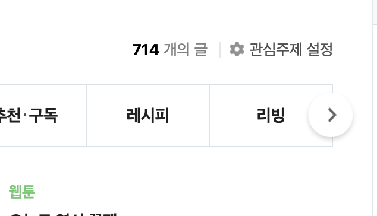
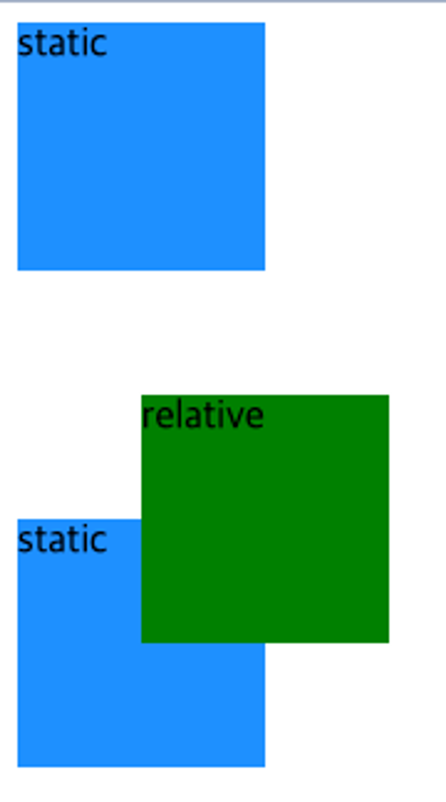

# Position

UI에 따라 때로 요소가 다른 요소 위에 올라간듯한 모습을 보일때가 있다.



이런 UI의 요소는 일반적인 HTML 요소의 배치 방식에서 벗어난다. 이런 UI 구성을 위해선 `position` 속성을 변경해준다. `position`은 다음과 같은 속성을 가질 수 있다.

- `static` (기본값)
- `relative`
- `absolute`
- `fixed`
- `sticky`

이들과 함께 `top`, `left`, `bottom`, `right` 속성을 이용하여 요소를 본래의 위치에서 이동시킬 수 있다.

## `relative`

본래 있던 위치에서 상대적으로 배치한다. 다른 요소들은 해당 요소가 `static`인 것처럼 배치되어, 공간이 생겨도 그 자리를 차지하지 않는다.

```css
.relative {
  background-color: green;
  position: relative;
}
```




## `absolute`

절대적인 위치를 기준으로 자리를 잡는다. 자신을 담고있는 `static`이 아닌 부모/조상 요소 기준. 다른 요소는 해당 요소가 없어진 것처럼 배치된다.

```css
.absolute {
  background-color: yellow;
  position: absolute;
}
```


## `fixed`

화면을 기준으로 요소를 배치한다. 스크롤을 해도 고정된 위치에 배치된다.

```css
.fixed {
  background-color: red;
  position: fixed;
}
```


## `sticky`

일반적인 요소처럼 동작하다가, 스크롤이 되는 부모 / 조상 요소와의 거리가 `top`, `left`, `bottom`, `right`에 주어진 값 이하의 거리가 될때, `fixed` 처럼 동작한다.


## `z-index`

`position`이 `static`이 아닌 요소들은 위로 쌓이게 된다. 이때 기본적으론 나중에 선언된 요소가 위로 오게 됨으로, 의도한데로 요소가 배치되지 않을 수 있다. 이때 `z-index`를 조절하면 요소가 쌓이는 순서를 조정할 수 있다.

```html
<body>
  <div class="box color-red"></div>
  <div class="box color-orange"></div>
  <div class="box color-yellow"></div>
  <div class="box color-green"></div>
  <div class="box color-blue"></div>
</body>
```

```css
.color-red {
  position: absolute;
  left: 0px;
  background-color: red;
  z-index: 5;
}

.color-orange {
  position: absolute;
  left: 50px;
  background-color: orange;
  z-index: 4;
}

.color-yellow {
  position: absolute;
  left: 100px;
  background-color: yellow;
  z-index: 3;
}

.color-green {
  position: absolute;
  left: 150px;
  background-color: greenyellow;
  z-index: 2;
}

.color-blue {
  position: absolute;
  left: 200px;
  background-color: blue;
  z-index: 1;
}
```


