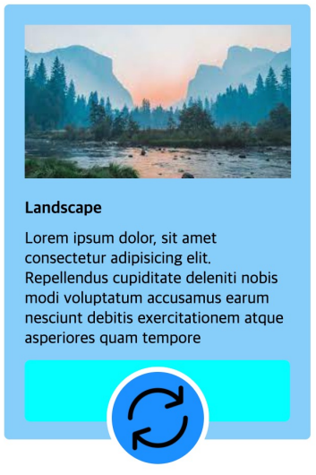
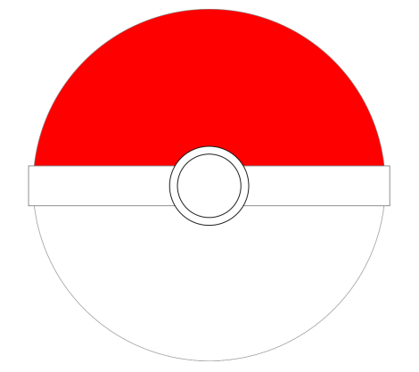

# CSS Box Model
## P1

[p1.html](p1.html)과 [p1.css](p1.css)를 사용합니다.
주어진 HTML이 다음 그림처럼 브라우저에 나오도록 HTML과 CSS를 수정하세요.

## P2

[p2.html](p2.html)과 [p2.css](p2.css)를 사용합니다.
주어진 HTML이 다음 그림처럼 브라우저에 나오도록 HTML과 CSS를 수정하세요.

## P3

[p3.html](p3.html)과 [p3.css](p3.css)를 사용합니다.
주어진 HTML이 다음 그림처럼 브라우저에 나오도록 CSS만 수정하세요.

