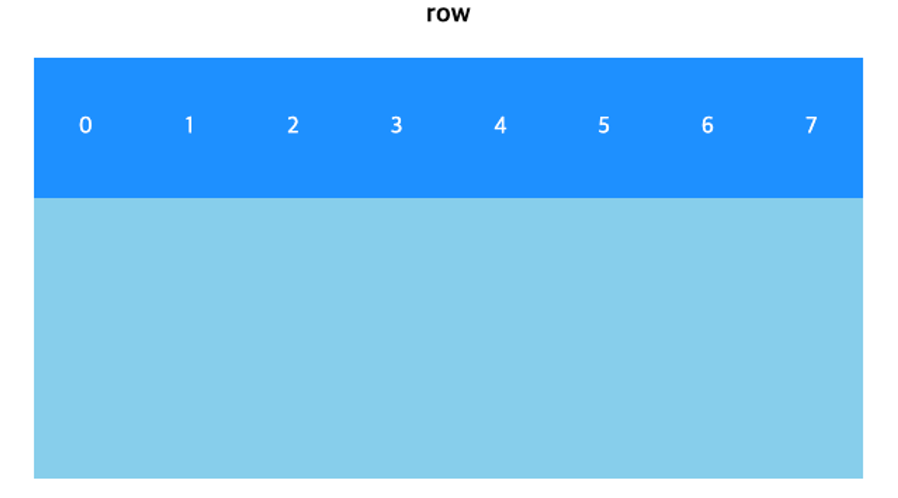
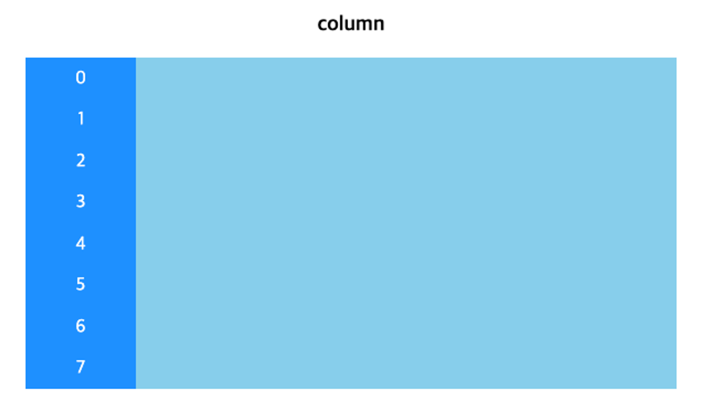
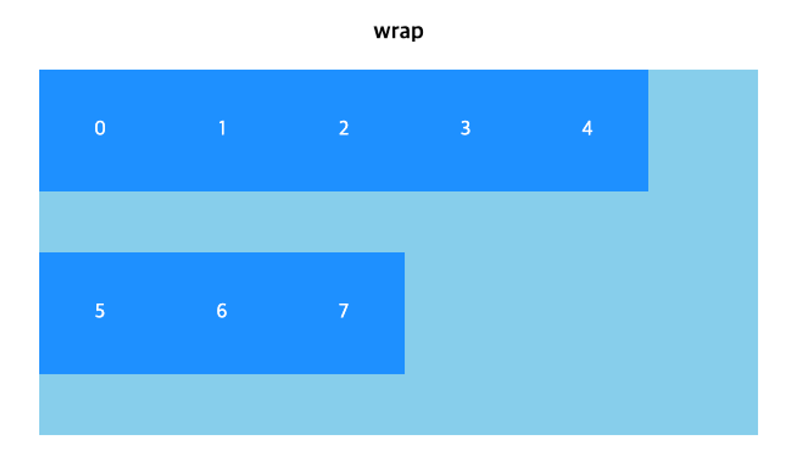
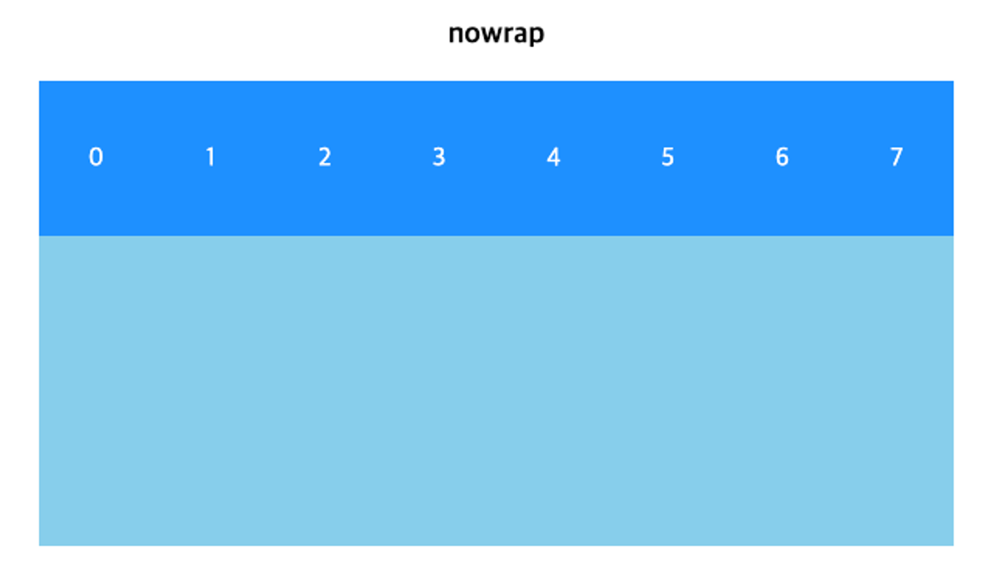

# Flexbox

Flexbox는 CSS를 이용해 Layout을 만드는데 특화된 속성이다. `display` 속성에 `flex`를 적용하면, 해당 요소의 자식 요소들은 유연하게 배치되어 Layout을 만드는데 도움이 된다.
- `display: flex;`가 적용된 요소가 Flex Container
- 그 요소의 자식 요소들이 Flex Item

으로 분류된다. Container의 `flex-direction`에 따라 정의된 주축과 교차축을 바탕으로 Item들을 정렬할 수 있다.

## `flex-direction`, `flex-wrap`

Container의 주축의 방향을 설정할 수 있다.

- `row`: 주축의 방향을 좌에서 우로 설정 (기본값)
- `column`: 주축의 방향을 상에서 하로 설정
- `row-reverse`: 주축의 방향을 우에서 좌로 설정
- `column-reverse`: 주축의 방향을 하에서 상으로 설정

```css
.flex-row {
  flex-direction: row;
}

.flex-column {
  flex-direction: column;
}

.flex-row-reverse {
  flex-direction: row-reverse;
}

.flex-column-reverse {
  flex-direction: column-reverse;
}
```




요소를 많이 넣게되면 한줄에 모든 요소가 안들어갈수 있다. 이때 요소를 다음줄로 보낼지, 아니면 한줄에 어떻게든 넣을지를 `flex-wrap` 속성으로 정의해준다.

- `wrap`: 넘치는 요소를 다음 줄에 출력
- `nowrap`: 요소를 줄여서라도 한줄에 출력

```css
.flex-wrap {
  flex-wrap: wrap;
}

.flex-nowrap {
  flex-wrap: nowrap;
}
```




## 정렬하기

Flex Container의 Item들은 축의 방향에 맞춰 요소들을 정렬할 수 있다.

- `justify-content`: 주축의 방향으로 요소들을 정렬
- `align-items`: 교차축의 방향으로 요소들을 정렬
- `align-content`: 두 줄 이상의 요소들을, 줄 단위로 교차축의 방향으로 정렬

### `justify-content`

주축의 방향으로 요소들을 정렬한다.

- `flex-start`: 주축의 시작 방향으로 정렬한다.
- `flex-end`: 주축의 끝 방향으로 정렬한다.
- `center`: 주축 가운데로 정렬한다.
- `space-around`: 각 요소 주변에 같은 여백을 배치한다. 양끝 여백은 중간의 여백들에 비해 절반이 된다.
- `space-between`: 양 끝 요소는 부모의 테두리에 닿으면서, 요소 사이의 여백은 동일해진다.
- `space-evenly`: 모든 여백이 동일해진다.

```css
/* justify-content */

.justify-content-start {
  justify-content: flex-start;
}

.justify-content-end {
  justify-content: flex-end;
}

.justify-content-center {
  justify-content: center;
}

.justify-content-between {
  justify-content: space-between;
}

.justify-content-around {
  justify-content: space-around;
}

.justify-content-evenly {
  justify-content: space-evenly;
}
```

### `align-items`

교차축의 방향으로 요소들을 정렬한다.

- `flex-start`: 교차축의 시작 방향으로 정렬한다.
- `flex-end`: 교차축의 끝 방향으로 정렬한다.
- `center`: 교차축 가운데로 정렬한다.
- `stretch`: 요소를 교차축 방향으로 전체를 채운다. 요소의 `height`가 고정되어 있으면 작동하지 않는다.

```css
/* align-items */

.align-items-start {
  align-items: flex-start;
}

.align-items-end {
  align-items: flex-end;
}

.align-items-center {
  align-items: center;
}

.align-items-stretch {
  align-items: stretch;
}
```

`justify-content: center;`와 `align-items: center;`를 동시에 Container에 적용하면, Item들이 전부 중앙 정렬된다.

### `align-content`

교차축의 방향으로 요소의 줄들을 정렬한다. 하나의 줄을 하나의 요소라고 생각한 다음, 교차축의 방향으로 `justify-content`를 하는 것을 생각해보자.

- `flex-start`: 교차축의 시작 방향으로
- `flex-end`: 교차축의 끝 방향으로
- `center`: 교차축 가운데로
- `space-around`: 각 요소 주변에 같은 여백을 배치한다. 양끝 여백은 중간의 여백들에 비해 절반이 된다.
- `space-between`: 양 끝 요소는 부모의 테두리에 닿으면서, 요소 사이의 여백은 동일해진다.
- `space-evenly`: 모든 여백이 동일해진다.

```css
/* align-content */

.align-content-start {
  align-content: flex-start;
}

.align-content-end {
  align-content: flex-end;
}

.align-content-center {
  align-content: center;
}

.align-content-between {
  align-content: space-between;
}

.align-content-around {
  align-content: space-around;
}

.align-content-evenly {
  align-content: space-evenly;
}
```

두줄 이상의 요소들에 대해서만 동작하는 속성임으로, `flex-wrap: nowrap;`이나 한줄의 요소들에 대해서는 동작하지 않는다.
