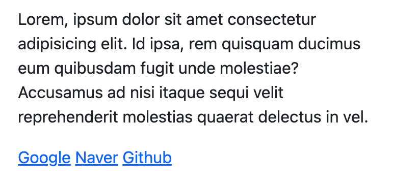
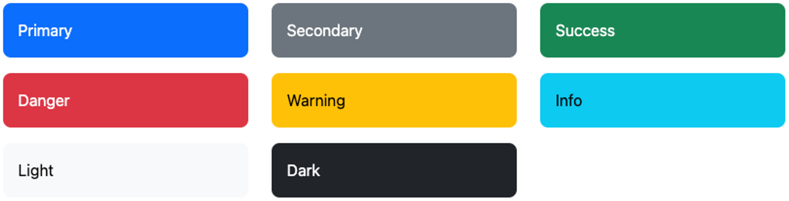
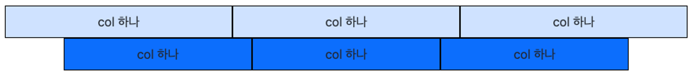
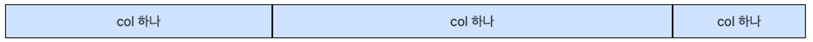
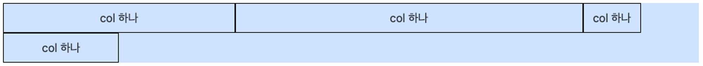
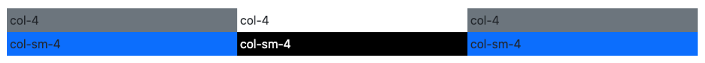
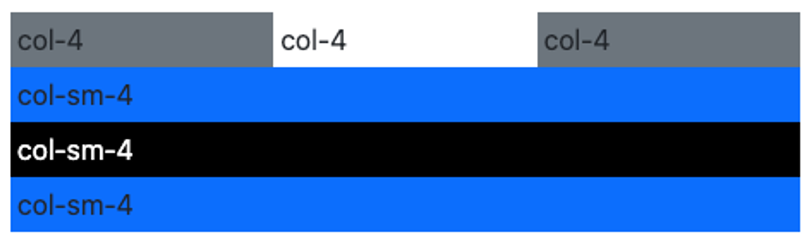

# Bootstrap

Bootstrap은 2011년 처음 등장한 오픈소스 프런트엔드 프레임워크이다. 미리 작성된 CSS와 JS를 이용해 목록, 표, 버튼 등의 요소는 물론 드랍다운 메뉴, 캐러셀, 모달 등의 사용자 UI 요소를 쉽게 만들 수 있게 도와준다.

## Bootstrap 적용하기

Bootstrap은 기본적으로 이미 만들어진 CSS와 JS이다. 이를 HTML에 추가해줌으로서 사용할 수 있다. 두가지 방법으로 적용이 가능한데,

- 직접 Bootstrap 홈페이지에서 CSS, JS를 다운로드 해서 `link`와 `script` 요소로 추가해준다.
- CDN을 통해서 웹에서 바로 HTML에 추가해준다.

```html
<!doctype html>
<html lang="en">
<head>
  <meta charset="utf-8">
  <meta name="viewport" content="width=device-width, initial-scale=1">
  <title>Bootstrap demo</title>
  <link href="https://cdn.jsdelivr.net/npm/bootstrap@5.3.2/dist/css/bootstrap.min.css" rel="stylesheet" integrity="sha384-T3c6CoIi6uLrA9TneNEoa7RxnatzjcDSCmG1MXxSR1GAsXEV/Dwwykc2MPK8M2HN" crossorigin="anonymous">
</head>
<body>
  <h1>Hello, world!</h1>
  <script src="https://cdn.jsdelivr.net/npm/bootstrap@5.3.2/dist/js/bootstrap.bundle.min.js" integrity="sha384-C6RzsynM9kWDrMNeT87bh95OGNyZPhcTNXj1NW7RuBCsyN/o0jlpcV8Qyq46cDfL" crossorigin="anonymous"></script>
</body>
</html>
```

단순히 추가하는 것만으로도 HTML의 모습이 조금 바뀐다. Bootstrap에 정의된 CSS 때문이다.



## Bootstrap 기본 기능

Bootstrap에는 CSS를 통해 조정하는 많은 스타일을 미리 클래스 선택자를 이용해 사용할 수 있게 되어 있다. 자세한 내용은 Bootstrap 문서를 확인하며 사용할것

### Text 조절

`text-align` 조절하기

```html
<p class="text-start">text-start class 적용</p>
<p class="text-center">text-center class 적용</p>
<p class="text-end">text-end class 적용</p>
```

`font-weight`, `font-style` 적용하기

```html
<p class="fw-lighter">fw-lighter 굵기</p>
<p class="fw-light">fw-light 굵기</p>
<p class="fw-normal">fw-normal 굵기</p>
<p class="fw-bold">fw-bold 굵기</p>
<p class="fw-bolder">fw-bolder 굵기</p>

<p class="fst-italic">fst-italic 적용</p>
```

### 색상 조절

몇가지 용도로 구분해서 준비된 색상을 특정 패턴의 클래스와 이름을 조합해 적용해줄 수 있다.



글자(`color`)에 적용할땐 `text-*` 형태로 사용.

```html
<p class="text-primary">text-primary</p>
<p class="text-secondary">text-secondary</p>
<p class="text-success">text-success</p>
<p class="text-danger">text-danger</p>
<p class="text-warning">text-warning</p>
<p class="text-white bg-black">text-white</p>
```

요소의 배경색(`background-color`)으로 적용할땐 `bg-*` 형태로 사용.

```html
<div class="bg-primary">bg-primary</div>
<div class="bg-secondary">bg-secondary</div>
<div class="bg-success">bg-success</div>
<div class="bg-danger">bg-danger</div>
<div class="bg-warning">bg-warning</div>
<div class="bg-white">bg-white</div>
```

어떤 색상들의 경우 요소의 배경색과 글자색을 어울리게 동시에 적용할 수 있다. 이는 `text-bg-*` 형태로 사용.

```html
<div class="text-bg-primary">text-bg</div>
<div class="text-bg-secondary">text-bg</div>
<div class="text-bg-success">text-bg</div>
<div class="text-bg-danger">text-bg</div>
<div class="text-bg-warning">text-bg</div>
```

### Box Model

부모 요소의 크기를 기준으로 요소의 크기를 쉽게 조정 가능하다. 너비 (`w-*`)와 높이(`h-*`)를 25% 단위로 조절 가능.

```html
<div style="width: 500px; height: 500px;">
  <div class="w-50 h-50 bg-primary">
    <div class="w-50 h-50 bg-secondary"></div>
  </div>
</div>
```

`margin`과 `padding`도 사용 가능하다. 

```html
{m 또는 p}{방향}-{크기(0 ~ 5 또는 auto)}
```

- padding을 줄때 `p`, margin을 줄때 `m` 으로 시작
- 방향을 띄어쓰기나 `-` 없이 작성
    - top - `t`
    - bottom - `b`
    - start - `s`
    - end - `e`
    - left + right - `x`
    - top + bottom - `y`
    - 전체적용시에는 생략
- `-` 이후 어느정도로 적용하고 싶은지 작성

### Flexbox

`display: flex;`도 적용할 수 있다.

```html
<div class="w-100 d-flex bg-primary-subtle p-3">
  <div class="box border border-light text-bg-primary">0</div>
  <div class="box border border-light text-bg-primary">1</div>
  <div class="box border border-light text-bg-primary">2</div>
  <div class="box border border-light text-bg-primary">3</div>
</div>
```

Container의 축의 방향, Wrap 유무는 아래처럼 적용한다.

- `flex-row`: `flex-direction: row;`
- `flex-column`: `flex-direction: column;`
- `flex-row-reverse`: `flex-direction: row-reverse;`
- `flex-column-reverse`: `flex-direction: column-reverse;`
- `flex-wrap`: `flex-wrap: wrap;`
- `flex-nowrap`: `flex-wrap: nowrap;`
  
`justify-content`, `align-items`, `align-content`등의 정렬 기능도 다 클래스로 적용할 수 있다. 단, 몇가지 값은 활용하지 못한다.

**`justify-content`**
- `justify-content-start`: `justify-content: start;`
- `justify-content-end`: `justify-content: end;`
- `justify-content-center`: `justify-content: center;`
- `justify-content-between`: `justify-content: space-between;`
- `justify-content-around`: `justify-content: space-arount;`
- `justify-content-evenly`: `justify-content: space-evenly;`

**`align-items`**

- `align-items-start`: `align-items: start;`
- `align-items-end`: `align-items: end;`
- `align-items-center`: `align-items: center;`

**`align-content`**

- `align-content-start`: `align-content: start;`
- `align-content-end`: `align-content: end;`
- `align-content-center`: `align-content: center;`
- `align-content-between`: `align-content: space-between;`
- `align-content-around`: `align-content: space-around;`

```html
<div style="..." class="... d-flex justify-content-center align-items-center">
  <div class="... d-flex justify-content-center align-items-center">
    가운데 정렬된 상자입니다
  </div>
</div>
```

## Bootstrap Grid System

Bootstrap은 Grid System을 통해서 반응형 웹 페이지를 제작하는데 특화되어 있다.

### Row, Column

가장 간단하게는 `container` 클래스 안에 `row`와 `col`을 만들어 사용한다.

```html
<div class="container-fluid">
  <div class="row">
    <div class="col">col 하나</div>
    <div class="col">col 하나</div>
    <div class="col">col 하나</div>
  </div>
</div>
<div class="container">
  <div class="row">
    <div class="col">col 하나</div>
    <div class="col">col 하나</div>
    <div class="col">col 하나</div>
  </div>
</div>
```

각각의 `col`은 `row`가 차지할 수 있는 영역을 균등히 차지한다.



만약 하나의 `col`이 좀더 크길 바란다면, `row`는 12칸으로 이뤄져 있음을 기억하자. `col-*`의 형태로 12칸 중 몇칸을 차지할 것인지를 결정할 수 있다.

```html
<div class="container-fluid">
  <div class="row">
    <div class="col-4">col 하나</div>
    <div class="col-6">col 하나</div>
    <div class="col">col 하나</div>
  </div>
</div>
```



만약 `col`의 합이 12를 넘어가면 다음줄에 출력된다.

```html
<div class="container-fluid">
  <div class="row">
    <div class="col-4">col 하나</div>
    <div class="col-6">col 하나</div>
    <div class="col-1">col 하나</div>
    <div class="col-2">col 하나</div>
  </div>
</div>
```



또한 `gx-*`와 `gy-*` 클래스로 요소의 간격을 벌여줄 수 있다.

```html
<div class="container text-center">
	<div class="row gy-3 gx-3">
	  <div class="col-6">
	   <div class="bg-success py-2">간격 벌리기</div>
	  </div>
	  <div class="col-6">
	    <div class="bg-success py-2">간격 벌리기</div>
	  </div>
	  <div class="col-6">
	    <div class="bg-success py-2">간격 벌리기</div>
	   </div>
	   <div class="col-6">
	     <div class="bg-success py-2">간격 벌리기</div>
	   </div>
	</div>
</div>
```


### Breakpoints

`col`의 크기를, 화면의 크기에 따라 다르게 차지하도록 조정해줄 수 있다. 이를 이용해 반응형 웹 페이지를 제작한다.

```html
<div class="container-fluid">
  <div class="row">
    <div class="col-4 bg-secondary p-1">col-4</div>
    <div class="col-4 bg-warn p-1">col-4</div>
    <div class="col-4 bg-secondary p-1">col-4</div>
  </div>
  <div class="row">
    <div class="col-sm-4 bg-primary p-1">col-sm-4</div>
    <div class="col-sm-4 bg-black text-white p-1">col-sm-4</div>
    <div class="col-sm-4 bg-primary p-1">col-sm-4</div>
  </div>
</div>
```

화면의 크기가 576px 이상일때는 위와 아래 둘다 한줄에 3개의 요소가 배치되지만, 그보다 작아지면 `col-sm-4`는 한줄에 하나의 요소가 배치된다.




이를 이용해 다양한 화면 사이즈에 대하여 요소들이 배치되는 방식을 변경하여 반응형 UI를 만들 수 있다.


